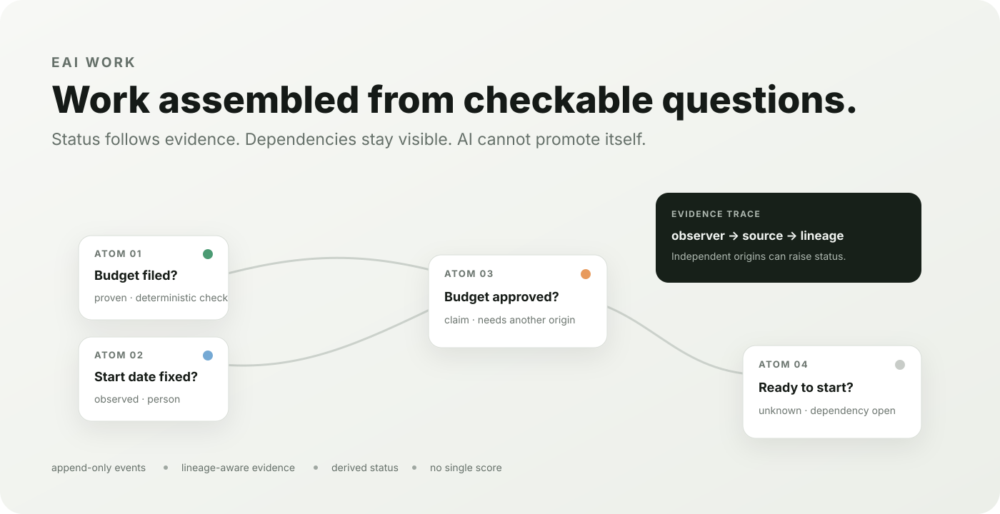
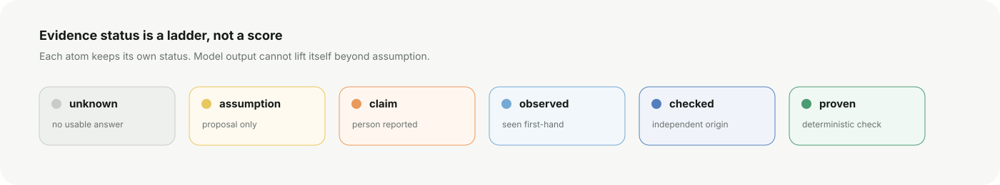

<p align="center">
  
</p>

# EAI work

**Split work into the smallest checkable questions. Keep evidence and its origin visible. Derive status instead of editing it.**

EAI work is an evidence-first workbench. AI may propose an answer, flag a problem or lower confidence. It may not raise the status of its own output. Stronger status comes from person-attached evidence, independent origins or deterministic non-LLM checks.


## What it looks like

The browser workbench is built around the parts that matter during review:

- a **work graph** grouped by cluster;
- a visible **status distribution**, never one aggregate score;
- **dependency markers** on each atomic question;
- a separate **evidence inspector** with observer, source, lineage and validity;
- a **review queue** for rule flags, weak prerequisites and coverage prompts;
- an **append-only log integrity** indicator.

<p align="center">
  
</p>

## The model

Every job is described as a pack of **atoms**. An atom is one question with one typed answer. `unknown` is always valid.

Status follows this ladder:

`unknown → assumption → claim → observed → checked → proven`

The transition is asymmetric. A model answer can create an assumption. A person report can create a claim. First-hand observation can create observed status. Independent trusted actors can create checked status. A deterministic server-registered check can create proven status. Status is recalculated from the event log and current evidence each time.

In the HTTP server, person and system evidence lineage is assigned by the server from actor identity. A client cannot create extra independent origins by changing a lineage string. `check.passed` is server-generated only.

Every token maps to a principal with explicit `read`, `write`, `checks` and optional `audit` permissions. Access is default-deny. State, explanations, dependencies, rule output, checksums and review data are filtered to the atoms that principal may read. Deterministic checks declare their own `reads` set; a caller must be allowed to read every declared input, and the check receives only that scoped state.

## System shape

```text
pack.json
   │
   ├── atoms + dependencies + rules
   │
   ▼
append-only event log ──► replay ──► derived atom state
        ▲                              │
        │                              ├── distributions
person / model / check                 ├── review signals
                                       └── evidence inspector
```

The core package has no network access. The server owns actor identity, event ids and time. Attempts to bypass status rules are rejected and stay observable through the event flow.

## Quickstart

Requires Node `22.18+`. No runtime dependencies are required.

```bash
npm test
npm run lint:pack
npm run replay:demo
cp tokens.example.json tokens.json
# Replace every REPLACE_... key with a random secret, for example:
# openssl rand -hex 32

openssl genpkey -algorithm Ed25519 -out witness-private.pem
openssl pkey -in witness-private.pem -pubout -out witness-public.pem
mkdir -p ../eai-witness

EAI_TOKENS=tokens.json \
EAI_WITNESS_DIR=../eai-witness \
EAI_WITNESS_PRIVATE_KEY=./witness-private.pem \
EAI_WITNESS_PUBLIC_KEY=./witness-public.pem \
npm run serve
```

Open `http://127.0.0.1:8787`. The server requires an explicit `EAI_TOKENS` file, rejects placeholder/example tokens and binds to `127.0.0.1` by default. It also requires an Ed25519-signed, cryptographically chained witness journal outside `EAI_DIR`. Put that witness directory on a separate mounted volume or other rollback-resistant storage in deployments where datastore rollback must remain detectable. Keep the private key in a secret store or protected mount. Set `EAI_HOST` only when you deliberately want to expose the service on another interface.

Existing deployments with non-empty logs need one explicit trust-on-first-use step before first start with this version:

```bash
eai verify-local ./data
eai bootstrap-witness ./data ../eai-witness ./witness-private.pem ./witness-public.pem
eai verify-log ./data ../eai-witness ./witness-public.pem
```

Only bootstrap a log whose local chain and current head you already trust. After bootstrap, use `verify-log` for full verification; `verify-local` checks only the datastore itself.

The HTTP write path uses a cached verified head and file fingerprints, so normal writes and rejected requests do not rescan the full event or witness history. Startup, `verify-log` and audit verification still perform a full chain check. Any external change to tracked log/head/witness files invalidates the fast path and forces full verification.

Useful CLI commands:

```text
eai lint-pack <pack.json>
eai replay <pack.json> <events.jsonl>
eai explain <pack.json> <events.jsonl> <atom>
eai report <pack.json> <events.jsonl> [goal-atom,...]
eai agree <answersA.json> <answersB.json>
eai verify-local <data-dir>
eai verify-log <data-dir> <witness-dir> <public-key.pem>
eai bootstrap-witness <data-dir> <witness-dir> <private-key.pem> <public-key.pem>
```

## Repository map

| Path | Purpose |
|---|---|
| `packages/core` | Derivation, validation, replay, rules, analysis, agreement and calibration. No network. |
| `packages/server` | Token-derived identity, hash-chained event storage and HTTP API. |
| `packages/client` | Dependency-free evidence-first workbench. |
| `packages/gateway` | Typed model interface. Mock provider only in v0.1. |
| `packages/cli` | Pack linting, replay, explanation, reports, agreement and log verification. |
| `schema/v0.1` | Draft JSON Schema. Not yet enforced in code. |
| `conformance` | Behavioral vectors any compatible implementation should pass. |
| `packs` | Example packs. Current data is invented demo data. |
| `evidence` | Research bibliography with a source type for every claim. |
| `proposals` | Design proposals. |
| `docs` | Architecture and interface notes. |

## Guarantees in v0.1

- **Derived status:** no actor edits status directly.
- **Model asymmetry:** models may not raise status or impersonate a person.
- **Server-controlled independence:** public clients cannot mint extra evidence origins; person/system lineage is derived from trusted actor identity.
- **Deterministic proof:** `proven` requires a server-registered deterministic check; public clients cannot submit `check.passed`.
- **Scoped authorization:** principals only see and modify explicitly permitted atoms; audit and check execution are separate permissions.
- **Replayable state:** state is rebuilt from an append-only hash-chained log.
- **Signed rollback detection:** event and rejection heads are Ed25519-signed into cryptographically chained witness journals outside the datastore. Datastore rollback is detected while the witness store remains outside the rollback domain.
- **Visible uncertainty:** reporting is a distribution over atom statuses, not one score.
- **Review wording:** no flags means “not detected”, not “safe”.

The normative behavior lives in `conformance/vectors/`. If this README, the specification and a conformance vector disagree, the mismatch should be fixed explicitly in a PR.

## Current limits

Not built yet: a real model provider, production authentication, a database, schema enforcement at runtime, pack authoring UI, user testing, a second domain pack and the planned top-down versus bottom-up comparison.

## Interface direction

The repository presentation and workbench borrow only **presentation patterns** from strong contemporary AI repositories: a concise first screen, a system diagram before deep documentation, progressive disclosure, visible operational status and short paths from concept to runnable example. EAI work uses its own copy, diagrams, colors and information model. See `docs/interface-notes.md` for the references and translation choices.
